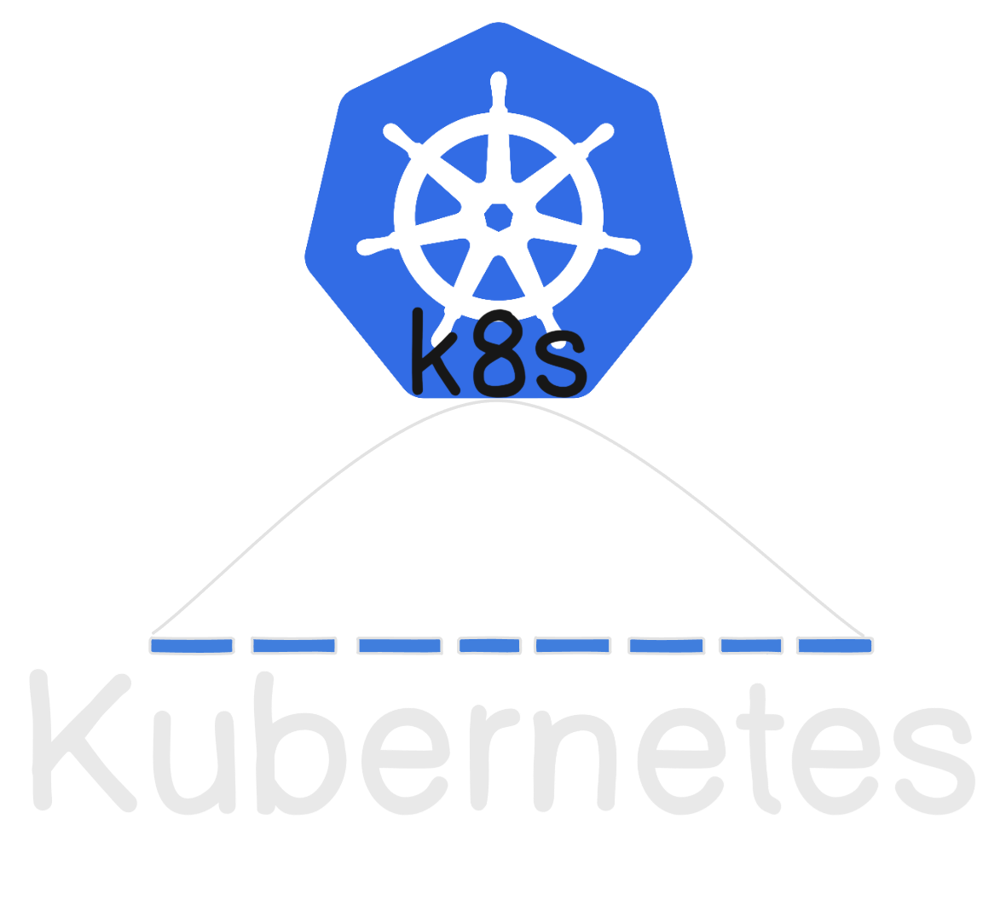

  

## Basics

1. Kubernetes History
2. Why shoud we learn kubernetes(k8s)

## Core Concepts:

1. Monolithic Vs Microservices
2. Kubernetes Architecture
3. Setup on Local/AWS EC2
4. Kubectl
5. Pods
6. Namespaces
7. Labels
8. Selectors
9. Annotations

## Workloads:

1. Deployment
2. Statefulset
3. DaemonSets
4. ReplicaSets
5. Jobs
6. CronJobs

## Networking

1. Cluster Networking
2. Services
3. Ingress
4. Network Policies

## Storage

1. Persistent Volumes(PV)
2. Persistent Volume Claim(PVC)
3. Storage Classes
4. ConfigMaps
5. Sectres

## Scaling and Scheduling

1. Horizontal Pod Auto-Scaling (HPA)
2. Virtical Pod Auto-Scaling (VPA)
3. Node Affinity
4. Taint/Tolerations
5. Resource Qoutas
6. Limits
7. Probes

## Cluster Administration

1. Role Based Access Conrol (RBAC)
2. Cluster Upgrade
3. Custom Resource Definitions (CRDs)

## Monitoring and Logging

1. Metrics Server
2. Logging
3. Monitoring Tools

## Advanced Features

1. Operators
2. Helm/Helm Charts
3. Service Mesh
4. Kubernetes API

## Security

1. Pod Security Standards (PSS)
2. Image Scanning
3. Network Policies
4. Secrets Ecryption

## Cloud-Native Kubernetes

1. Managed Services:
   1. Elastic Kubernetes Services(EKS)
   2. Azure Kubernetes Services(AKS)
   3. Google Kubernetes Engine(GKE)
2. Cluster Autoscaler
3. Spot/Preemptible Nodes

## Debugging and Troubleshooting

1. Kubectl Debugging
2. Logs
3. Resource Usage Analysis
